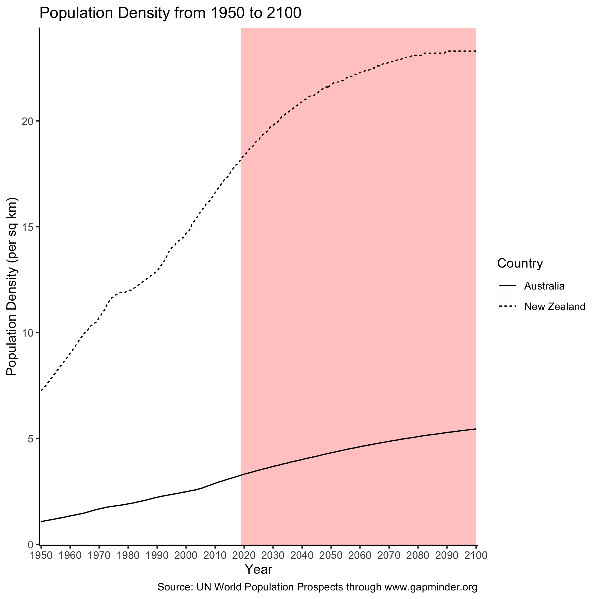

```{r setup, include=FALSE}
knitr::opts_chunk$set(echo = TRUE)
```

## Introduction

We wanted to create an example set of files for use in a hands-on exercise.
This RMarkdown document is a part of that.

## Include the Figure



## Conclusion

It looks like New Zealand has a higher population density than Australia.
Thank you for reading.
